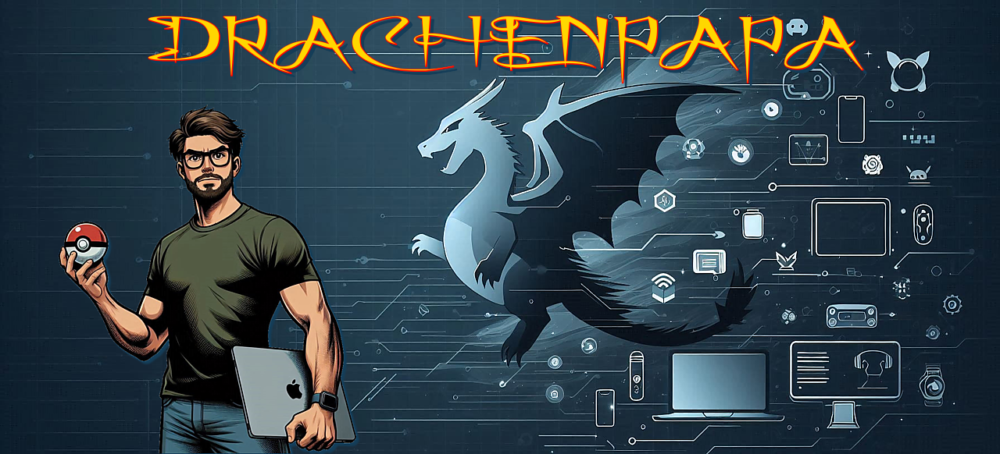

    &nbsp;
    &nbsp;
    &nbsp;

## 👋 Hi, I’m Henning
#### <i>Father of two, author of many</i>

I'm a passionate Software Engineer working at <a href="https://github.com/hmmh">@hmmh AG</a>, where I specialize in Java development.
My team at INDI is driven by a shared passion for agile development and creating custom software solutions tailored to our clients' needs.
I thrive on tackling complex development challenges, with a particular focus on building scalable, high-performance systems and ensuring robust security measures through rigorous testing practices.
I'm also a certified ISTQB Foundation Level Tester with the Agile Tester Extension, committed to delivering secure and high-quality code, especially in agile environments.

In my spare time, I love spending time with my family, staying active through jogging and exploring new areas in Pokémon Go.

### 🚀 Projects
Here are some of the projects I'm working on at the moment:
- [Finance Tool](https://github.com/drachenpapa/finance-tool) – A Java-based application for managing personal finances, featuring account tracking, custom categories, and transaction history.
- [Genderify](https://github.com/drachenpapa/genderify) – An Office Add-In for suggesting gender-neutral alternatives in German text. Users can also easily apply customizable gender markers (e.g., *, :).
- [Zatacka](https://github.com/drachenpapa/zatacka) – A remake of the classic multiplayer game Zatacka, built in Java Swing. Players control growing lines, aiming to outlast opponents without crashing.

### 📚 Currently Learning
I'm always looking to expand my skillset. Right now, I'm diving into:
- **Ruby / JRuby / Ruby on Rails** – Exploring the Ruby ecosystem to broaden my knowledge of web development frameworks.
- **Software Test Management** – Currently advancing my ISTQB certifications with a focus on managing and optimizing test processes to ensure maximum software quality.

### 💻 Tech Stack

